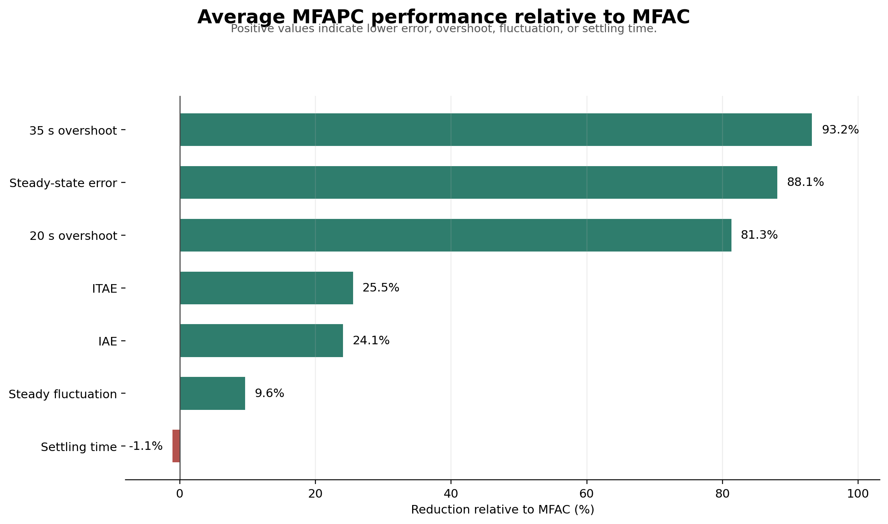
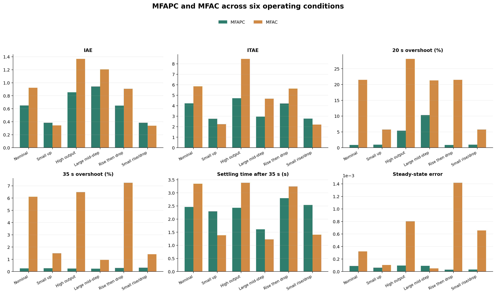

# MFAPC-Based Hydropower Generation Control

This project evaluates a model-free adaptive predictive controller (MFAPC) for active-power tracking in a Simulink hydropower generation model. It extends an earlier undergraduate simulation model with reproducible parameter sweeps, metric-based tuning, operating-condition tests, and a controlled comparison against a model-free adaptive controller (MFAC).

## Main result

Across six deterministic operating conditions, the tuned MFAPC reduced the average integral absolute error by **24.09%**, the average time-weighted absolute error by **25.54%**, and directional overshoot after the 20 s and 35 s reference changes by **81.31%** and **93.20%**, respectively, relative to MFAC.

The mean settling time was essentially unchanged: MFAPC was **1.06% slower** on average. MFAC was faster and produced lower integrated error in the two smallest-step cases, while MFAPC provided substantially better overshoot suppression and generally better steady-state accuracy.





## Final MFAPC parameters

The controller parameter vector is ordered as:

```matlab
% [lambda, rho, alpha_r, du_limit, eta, mu, alpha_d]
controller_params = [2.40, 0.32, 0.18, 0.030, 0.06, 0.08, 0.08];
```

The final values were selected through sensitivity analysis, a 36-case joint search, a 12-case local search, and a focused three-case refinement of `alpha_r`.

## Conventional MPC baseline

A conventional fixed-model MPC baseline is included as a third controller. It
uses a stable second-order affine ARX prediction model identified from four
dedicated trajectories that are separate from the six benchmark conditions.
The first three trajectories are used for fitting and the fourth is held out.

Free-run validation showed that the original `0.01 s` model's excellent
one-step score did not translate directly to closed-loop prediction. The final
controller therefore uses a separately fitted `0.05 s` model, executes every
five plant samples, predicts 40 samples (`2.0 s`), and optimizes four future
input moves. It uses an input-move weight of `20`, `|delta u| <= 0.020` per MPC
update, and `-1.15 <= u <= 1.15`. A projected-gradient QP solver avoids a
run-time dependency on Model Predictive Control Toolbox.

Run the MPC workflow in MATLAB R2023a:

```matlab
run('scripts/identify_mpc_model.m')
run('scripts/analyze_mpc_model_orders.m')
run('scripts/build_mpc_model.m')
run('scripts/run_mpc_comparison.m')
```

The generated model is named `models/HT_ctrl_MPC_baseline.slx` so it cannot
overwrite an earlier model named `HT_ctrl_MPC.slx`. See
[`docs/MPC_DESIGN.md`](docs/MPC_DESIGN.md) for the formulation and outputs.

Across all six conditions, MPC achieved the lowest IAE in every case. Its mean
IAE was `0.572218`, an `11.11%` reduction relative to tuned MFAPC and `32.52%`
relative to MFAC. Mean ITAE was `3.573921`. The tradeoff is higher mean 35 s
directional overshoot (`3.5333%`) and steady-state error (`0.003122`) than
MFAPC, so this controller should be presented as a tracking-error baseline, not
as uniformly superior on every metric.

## Evaluation metrics

- **IAE:** integral of absolute tracking error from 20 to 50 s.
- **ITAE:** integral of time-weighted absolute tracking error from 20 to 50 s, using time measured from 20 s.
- **Directional overshoot:** overshoot for upward steps and undershoot for downward steps, expressed as a percentage of the target.
- **Settling time:** time after the 35 s reference change required to remain within a 2% target band.
- **Steady-state error:** absolute difference between the mean output from 45 to 50 s and the final target.
- **Steady-state fluctuation:** peak-to-peak output variation from 45 to 50 s.

## Operating conditions

| Scenario | Reference sequence |
|---|---|
| Nominal | 0.50 → 0.75 → 0.90 pu |
| Small upward steps | 0.50 → 0.65 → 0.75 pu |
| High output | 0.50 → 0.80 → 0.95 pu |
| Large middle step | 0.50 → 0.85 → 0.90 pu |
| Rise then drop | 0.50 → 0.75 → 0.60 pu |
| Small rise then drop | 0.50 → 0.65 → 0.55 pu |

The reference changes occur at 0, 20, and 35 s.

## Average comparison

| Metric | MFAPC | MFAC | MFAPC reduction |
|---|---:|---:|---:|
| IAE | 0.643752 | 0.848029 | 24.09% |
| ITAE | 3.608410 | 4.845817 | 25.54% |
| 20 s directional overshoot | 3.2371% | 17.3170% | 81.31% |
| 35 s directional overshoot | 0.2686% | 3.9507% | 93.20% |
| Settling time after 35 s | 2.3557 s | 2.3309 s | −1.06% |
| Steady-state error | 0.000067 | 0.000560 | 88.10% |
| Steady-state fluctuation | 0.004049 | 0.004480 | 9.62% |

### Three-controller results

| Metric | MPC | MFAPC | MFAC |
|---|---:|---:|---:|
| IAE | 0.572218 | 0.643752 | 0.848029 |
| ITAE | 3.573921 | 3.608410 | 4.845817 |
| 20 s directional overshoot | 3.9201% | 3.2371% | 17.3170% |
| 35 s directional overshoot | 3.5333% | 0.2686% | 3.9507% |
| Settling time after 35 s | 2.4569 s | 2.3557 s | 2.3309 s |
| Steady-state error | 0.003122 | 0.000067 | 0.000560 |
| Steady-state fluctuation | 0.005228 | 0.004049 | 0.004480 |

## Reproduction workflow

The experiments were run in MATLAB R2023a with Simulink. Required installed products included MATLAB, Simulink, Control System Toolbox, Optimization Toolbox, Simscape, and Simscape Electrical.

Recommended project structure:

```text
Hydropower_Control_Project/
├── 01_original/
├── 02_working/
├── results/
└── scripts/
```

Key experiment outputs:

```text
results/mfapc_parameter_sweep.csv
results/mfapc_joint_search.csv
results/mfapc_local_search.csv
results/mfapc_alpha_refine.csv
results/mfapc_operating_condition_results.csv
results/mfapc_vs_mfac_comparison_v4.csv
```

The final comparison uses two independent models. The MFAPC model is simulated with the tuned parameter vector, while the MFAC model is simulated separately under the same reference profiles and 50 s stop time.

## Findings and limitations

MFAPC produced lower IAE and ITAE in four of six scenarios, lower directional overshoot in all six scenarios, lower steady-state error in five scenarios, and lower steady-state fluctuation in five scenarios. Its strongest advantage was transient overshoot suppression under nominal, high-output, and rise-then-drop profiles.

The large 0.50-to-0.85 pu change still produced a 10.34% MFAPC overshoot, which identifies a practical operating boundary. MFAC was faster for the smallest reference changes. The current study is deterministic and simulation-only; it does not yet include plant-parameter uncertainty, sensor noise, Monte Carlo trials, or hardware-in-the-loop validation. These limitations should be stated when presenting the project.

## Resume-ready description

**Model-Free Adaptive Predictive Control for Hydropower Generation — MATLAB/Simulink**

- Reconstructed and extended a hydropower generation control model in MATLAB/Simulink, implementing a reproducible workflow for MFAPC parameter tuning and performance evaluation.
- Automated sensitivity, joint-grid, and local parameter searches using IAE, ITAE, overshoot, settling time, and steady-state metrics to select a final seven-parameter controller configuration.
- Evaluated MFAPC against MFAC across six upward and downward reference profiles; reduced mean IAE by 24.1% and directional overshoot by 81.3%–93.2%, while documenting the small-step settling-time tradeoff.
